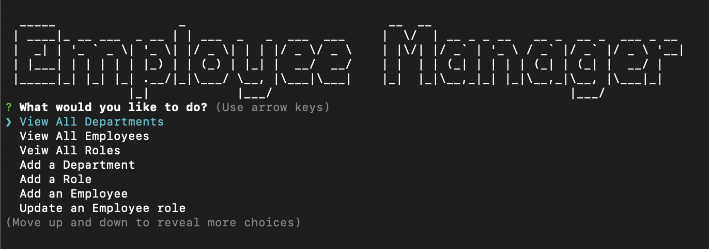
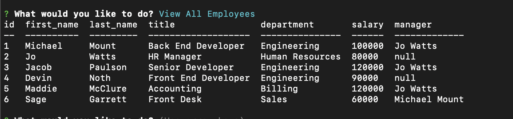

# Employee Track - CMS   

## Description

This CLI application easily allows any user to see their current employee, department, and role database. Quickly create new departments, employees, and roles. Chnage an employees basic information and who their manager is. This CLI application is fast and effective in creating your compaines employee database! 

[Walkthorugh Video](https://drive.google.com/file/d/1_DB3djql-uGUyJpt4MmhWfXmstr01hP_/view)

([SQL Workbench](https://www.mysql.com/products/workbench/) is Recommended to run this Apllication)

# Table of Contents

[Description](#description)

  [How to Install](#install)

  [How to Use](#usage)

  [How to contribute](#contribute)

  [How to Test](#test)

  [License](#license)

[Contact Me](#contact)

## Installation

  To install: 
     
    1) Clone down this repo 
    2) Run the cmd line "npm i" to install required modules 
    3) Please make sure to start your SQL sever prior to running the CLI Application
    3) Run the command line, "npm start" to begin application

  ### Once the Application is running, you should see the following: 

  

  ### Employee Table: 
  

## Usage

Once the application has been installed and running: use the arrow keys to select which opition you would like to use. Follow the onscreen prompt to eitehr view your current employees, departments, and roles. Or add a new employee. You can even remove old departments and roles.

### Walkthrough Gif:

## Contributing

If you would like to contribiute to this project, please reach out to my email!

## Tests

Please make sure you have run your SQL sever and used the schema and seeds to build a starting database

##  License

This project is licensed under the MIT license. 
 See [LICENSE](https://www.mit.edu/~amini/LICENSE.md) for more information!

## Question

If you have any questions or concerns about this project please contact me!

My gitHub account is: mmount98
  
Link to my [gitHub](https://github.com/mmount98) Account
 
You can always reach out via my email: mount.photos@gmail.com
  